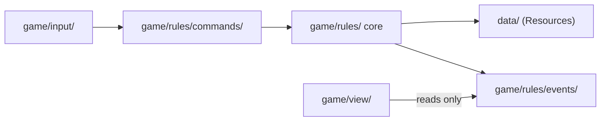

# Module map

Status: **Proposed.** To be grilled and accepted by the Director in M0-T08. No rules code is written before this is accepted (`CODE-STANDARDS.md` § 1).

Every class in the game is listed here before it is written: its file, what it extends, its one-sentence responsibility, and what it may depend on. Agents implement inside this map and never add to it themselves.

## Dependency rules

- `game/rules/` depends only on itself and data classes. Never on `game/view/` or `game/input/`.
- `game/view/` reads the event log and never changes rules state.
- `game/input/` turns key, trackpad and touch input into commands. It does not apply them itself.
- No dependency cycles anywhere.

## M0-T04: rules core skeleton (proposed)

The smallest structure that accepts a command and produces an event log. Only one command exists so far: wait.

| Class | File | Extends | Responsibility | May depend on |
|---|---|---|---|---|
| `Battle` | `game/rules/battle.gd` | `RefCounted` | Accepts commands from outside and returns the events they produced. | `BattleState`, `Command`, `CommandResult`, `EventLog` |
| `BattleState` | `game/rules/battle_state.gd` | `RefCounted` | Holds the current state of one battle: its units, current tick and acting unit. | `UnitState`, `BattleRandom` |
| `UnitState` | `game/rules/unit_state.gd` | `RefCounted` | Holds one unit's battle state: id, Speed, CT, tile and facing. | — |
| `BattleRandom` | `game/rules/battle_random.gd` | `RefCounted` | Produces every random number in a battle from its seed. | — |
| `Command` | `game/rules/commands/command.gd` | `RefCounted` | Describes one intended action and checks and applies itself to a battle state. | `BattleState`, `CommandResult`, `EventLog` |
| `WaitCommand` | `game/rules/commands/wait_command.gd` | `Command` | Ends the acting unit's turn without moving or acting. | as `Command` |
| `CommandResult` | `game/rules/commands/command_result.gd` | `RefCounted` | Says whether a command was accepted and, if not, why. | — |
| `EventLog` | `game/rules/events/event_log.gd` | `RefCounted` | Stores battle events in order and never changes them. | `BattleEvent` |
| `BattleEvent` | `game/rules/events/battle_event.gd` | `RefCounted` | One read-only entry in the event log, per `contracts/event-log.md`. | — |

Test: `tests/rules/test_wait_command.gd`.

## Planned for M1 (not accepted, not to be built yet)

Listed so the shape is visible. Each is grilled and accepted at M1 planning.

| Class | Responsibility |
|---|---|
| `BattleClock` | Advances ticks and decides whose turn it is. |
| `TurnCost` | Works out how much CT a finished turn costs. |
| `ChargedAbility` | Tracks one charging ability's gauge until it resolves. |
| `MoveCommand`, `ActCommand` | The other two turn actions. |
| `LawBook` | Checks commands against the battle's laws and issues cards. |
| `UnitDefinition`, `JobDefinition`, `AbilityDefinition`, `LawDefinition` | Data resources in `data/`. |

## Open questions for M0-T08

- Should `Command` apply itself to the state (as proposed), or should `Battle` apply commands? Applying itself keeps each action's rules in one class; the alternative keeps commands as plain data.
- Does `BattleState` own the `EventLog`, or does `Battle`? Proposed: `Battle`, so state stays pure data.
- GDScript has no exceptions. Is `CommandResult` enough for every failure, or do we need error codes as an enum?
