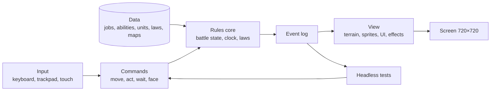
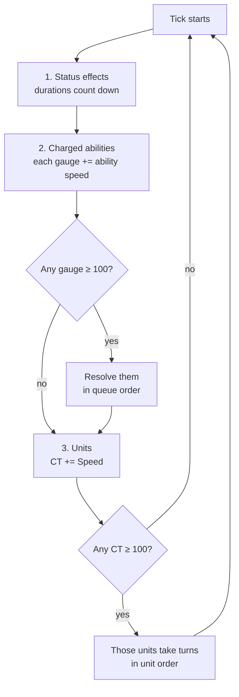
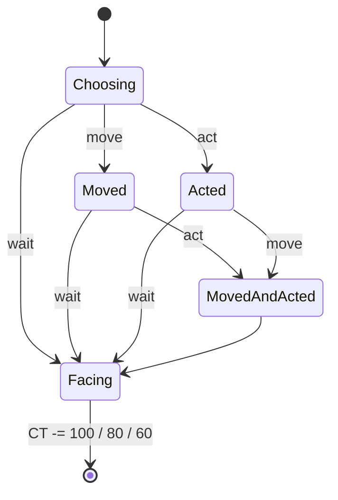

# Tech

Architecture, rendering setup, performance budget, folder layout and tooling. Changes here need a decision record.

## Architecture

The battle rules are a pure GDScript core with no nodes, scenes or rendering. Input becomes commands, the rules apply them and emit an event log, and the view plays the log back. See `decisions/ADR-004-rules-view-split.md`.

Consequences:

- Every rule can be tested without a display, in CI and by agents.
- A battle is reproducible from its seed plus its command list. Bugs are reported as seed + commands.
- Animation bugs can never change game state.

## The clock (one tick)

Order taken from FFT. Spec: `design/turn-system.md`.

## One unit's turn

## Development environment

The Hackberry is both the development machine and the target (ADR-007).

| | |
|---|---|
| Machine | HackberryPi CM5, Linux ARM64. A Mac may join later. |
| Everything runs here | Godot editor, agent command-line tools, Godot MCP bridge, tests, the game |
| Power and heat | Work plugged in. Long sessions will throttle on the passive heatsink; a small fan helps. |
| Screen | Prefer terminal and agent workflows. For editor sessions use HDMI to a monitor, or raise the editor's display scale. |
| Storage | NVMe strongly preferred over an SD card |
| Measuring performance | Close the editor and stop all agents first, or the numbers are meaningless |
| Tools | Every tool must run on Linux ARM64. Check before adopting one. |

## Rendering

| Setting | Value | Why |
|---|---|---|
| Renderer | Mobile (Vulkan) | Reported to run well on the Pi 5; Compatibility gave poor editor performance in user reports. Confirm in SPIKE-01. |
| 3D resolution | 360×360 in a viewport, scaled 2× to 720×720 with nearest filtering | Crisp pixels, a quarter of the pixel work |
| Camera | Orthographic, 4 rotations in 90° steps | FFT look; rotation is a pillar |
| Sprites | Upright, face the camera, 1 sprite pixel = 1 viewport pixel | Crisp at any rotation |
| Lighting | One directional light, blob shadows, no SSAO, GI or volumetrics | Pi GPU budget |
| Texture filter | Nearest, everywhere | One consistent pixel style |

## Performance budget

| Item | Budget | Status |
|---|---|---|
| Frame rate in battle | 30fps sustained, including after 10 minutes of play | Measured in SPIKE-01 |
| Frame time | ≤ 33ms, 1% lows reported | SPIKE-01 |
| Draw calls, sprite count, map size | Set from SPIKE-01 results | Pending |

## Folder layout

| Path | Owner | Contents |
|---|---|---|
| `game/rules/` | `mech` | Pure battle rules. No nodes or rendering. |
| `game/view/` | `env` | Scenes, camera, terrain, sprite playback, UI (M1) |
| `game/input/` | `env` | Keyboard, trackpad and touch to commands |
| `data/` | `mech` (Balance later) | Jobs, abilities, units, laws as data files |
| `maps/` | `env` | Map files per `contracts/map-format.md` |
| `assets/` | `art` | Sprites, textures, UI art, audio |
| `tests/rules/` | `mech` writes, `qa` reviews | Rules tests, including every worked example |
| `tests/integration/` | `qa` | Scene and end-to-end tests |
| `tools/` | `env` (Tools later) | Scripts, checkers, run helpers |
| `.github/` | `env` | CI workflows |
| `docs/`, `devlog/` | Director | Lanes edit only their own lane doc, handoffs, reports and changelog lines |

## Rules for all code

The full rules are in `CODE-STANDARDS.md` (ADR-008), and every class is listed in `MODULE-MAP.md` before it is written. The short version:

- Typed, object-oriented GDScript: one class per file, one responsibility per class.
- Hard size limits on files, functions and changes; no duplicated code.
- **Strings:** all on-screen text goes through string tables. No literal UI text in code.
- **Randomness:** only through the battle's seeded random number generator in `game/rules/`.
- **Numbers:** in `data/`, never hard-coded.
- **Engine version:** pinned in M0-T01. The latest stable is 4.7.2; 4.6.2 is reported running well on a Pi 5. Confirm 4.7.2 on the Hackberry, and fall back to 4.6.x if it misbehaves.

## Testing and checks

- GdUnit4, run headless locally and in a GitHub Action on every pull request (M0-T03).
- Every worked example in `docs/design/` becomes a test with the same numbers.
- `gdlint` (from gdtoolkit) with the limits in `CODE-STANDARDS.md`, and `gdformat` for formatting.
- `jscpd` duplicate detection over `game/`. Any duplicated block fails the check.
- Later: mutation testing (gdmutant) to check the tests actually catch bugs.

## Tooling

Installed and pinned in M0-T05. Read each before installing, project scope only, Linux ARM64 only.

| Tool | Purpose |
|---|---|
| godot-mcp (slangwald) | Claude Code ↔ Godot editor and running game, screenshots |
| GDScript language server plugin (minami110 or twaananen) | Real errors for agents instead of guesses |
| Matt Pocock's skills (`mattpocock-skills`) | Grilling, teaching, design and review disciplines. Usage map in `AGENTS.md` § Skills |
| One Godot skill pack: GodotPrompter or awesome-gamedev-agent-skills | Godot-specific agent knowledge. Optional; add only if agents keep getting Godot wrong |
| gdtoolkit (`gdlint`, `gdformat`) | Lint and format |
| jscpd | Duplicate detection |
| pixel-art-mcp + Blender MCP | Sprite pipeline, pending SPIKE-02. pixel-art-mcp's container is x86-64 only (ADR-007) |
